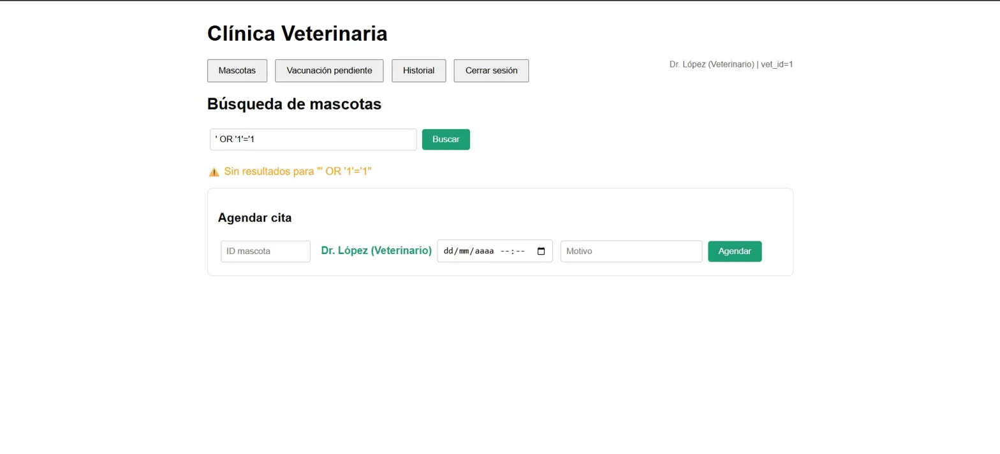
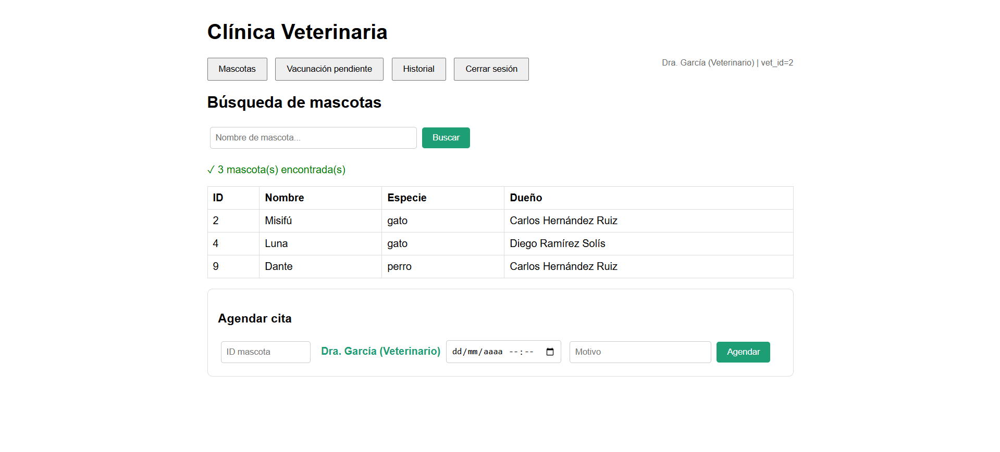
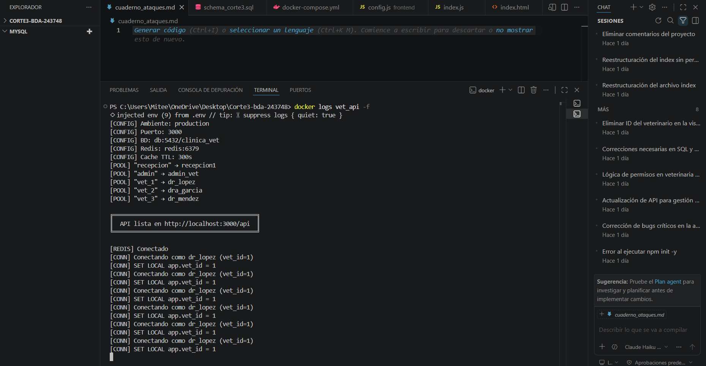
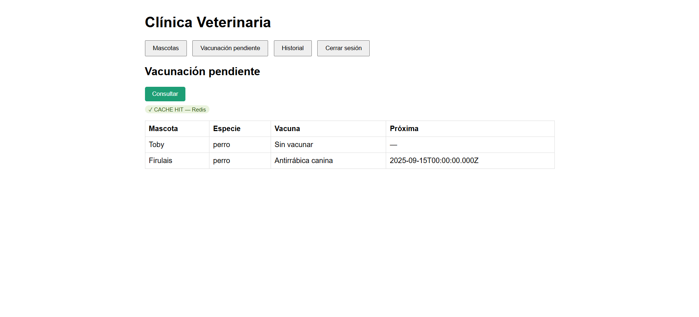

# Cuaderno de Ataques
## Sistema: Clínica Veterinaria · Corte 3 — Base de Datos Avanzadas
**Alumno:** [Mayte Jackellin Villanueva Velasco]  
**Matrícula:** 243748  
**Docente:** Mtro. Ramsés Alejandro Camas Nájera  

---

## Sección 1 — Tres ataques de SQL injection que fallan

Todos los ataques se ejecutaron desde la pantalla de **Búsqueda de mascotas**
(`http://localhost:3001`), que es la superficie principal de input del usuario.
En los tres casos el sistema respondió con **"Sin resultados"** — sin datos
extra, sin errores de BD, sin ejecución de código malicioso.

---
### Ataque 1 — Quote-escape clásico

**Input exacto probado:**
```
' OR '1'='1
```

**Pantalla:** Búsqueda de mascotas, sesión iniciada
como Dr. López (Veterinario, vet_id=1).

**Resultado observado:** El sistema devolvió `Sin resultados para "' OR '1'='1"`.
No se filtraron registros adicionales. RLS siguió activo — el veterinario
no vio mascotas de otros vets.

**Línea exacta que defendió el ataque:**  
Archivo: `api/index.js`, endpoint `GET /api/mascotas`:

```js
// Línea 78 — query parametrizada con $1
const result = await client.query(
    `SELECT m.id, m.nombre, m.especie, d.nombre AS dueno
     FROM mascotas m
     JOIN duenos d ON d.id = m.dueno_id
     WHERE m.nombre ILIKE $1`,
    [`%${q || ''}%`]   // $1 nunca se interpola en el string SQL
);
```

**Por qué funciona:** El driver `pg` de Node.js envía el valor
`' OR '1'='1` al servidor PostgreSQL como parámetro binario separado,
completamente desconectado del string SQL. PostgreSQL lo trata como texto
literal a buscar con `ILIKE`, no como código SQL. La comilla simple
nunca rompe la cadena de la query porque nunca forma parte de ella.

---

### Ataque 2 — Stacked query (intento de DROP TABLE)


**Input exacto probado:**
```
'; DROP TABLE mascotas; --
```

**Pantalla:** Búsqueda de mascotas, sesión
iniciada como Dr. López (Veterinario, vet_id=1).

**Resultado observado:** El sistema devolvió `Sin resultados para
"'; DROP TABLE mascotas; --"`. La tabla `mascotas` sigue existiendo —
confirmado porque búsquedas posteriores siguieron funcionando correctamente.

**Línea exacta que defendió el ataque:**  
Archivo: `api/index.js`, línea 78 (misma defensa que el Ataque 1).

**Por qué funciona:** El driver `pg` no permite múltiples statements en
una sola llamada a `client.query()`. El `;` es enviado como texto literal
dentro del parámetro `$1`, nunca como separador de statements SQL.
PostgreSQL recibe un único statement con el texto
`%'; DROP TABLE mascotas; --%` como valor de búsqueda `ILIKE`, que
no coincide con ningún nombre de mascota.

---

### Ataque 3 — Union-based (intento de extraer contraseñas)


**Input exacto probado:**
```
' UNION SELECT id, nombre, password, email FROM pg_shadow --
```

**Pantalla:** Búsqueda de mascotas — campo "Nombre de mascota...", sesión
iniciada como Dr. López (Veterinario, vet_id=1).

**Resultado observado:** El sistema devolvió `Sin resultados para
"' UNION SELECT id, nombre, password, email FROM pg_shadow --"`.
No se expusieron contraseñas ni datos del sistema.

**Línea exacta que defendió el ataque:**  
Archivo: `api/index.js`, línea 78 (misma defensa que los ataques anteriores).

**Por qué funciona:** Dos capas de defensa actúan simultáneamente:

1. La parametrización con `$1` neutraliza el ataque antes de que llegue
   a PostgreSQL — el `UNION SELECT` es texto literal, no SQL.
2. Aunque el ataque evadiera la parametrización, el usuario `dr_lopez`
   pertenece a `rol_veterinario`, que no tiene `SELECT` sobre `pg_shadow`
   (tabla de sistema con contraseñas). PostgreSQL rechazaría el query
   con `permission denied for table pg_shadow`.

---

## Sección 2 — Demostración de RLS en acción

**Setup:** El schema define explícitamente qué veterinario atiende a qué mascota
en la tabla `vet_atiende_mascota`:

| Veterinario | vet_id | Mascotas asignadas |
|---|---|---|
| Dr. Fernando López Castro | 1 | Firulais (id=1), Toby (id=5), Max (id=7) |
| Dra. Sofía García Velasco | 2 | Misifú (id=2), Luna (id=4), Dante (id=9) |
| Dr. Andrés Méndez Bravo | 3 | Rocky (id=3), Pelusa (id=6), Coco (id=8), Mango (id=10) |

---

### Dr. López consulta "todas las mascotas"

**Sesión:** Dr. López (Veterinario) | vet_id=1  
**Acción:** Clic en "Buscar" con el campo vacío (busca todas)  
**Resultado:** El sistema devuelve exactamente **3 mascotas**:
Firulais, Toby y Max — únicamente las suyas.

```
ID  Nombre    Especie  Dueño
1   Firulais  perro    María González Pérez
5   Toby      perro    María González Pérez
7   Max       perro    Roberto Cruz Domínguez
```

### Dra. García hace la misma consulta

**Sesión:** Dra. García (Veterinario) | vet_id=2  
**Acción:** Clic en "Buscar" con el campo vacío (busca todas)  
**Resultado:** El sistema devuelve exactamente **3 mascotas**:
Misifú, Luna y Dante — un conjunto completamente distinto al de Dr. López.

```
ID  Nombre  Especie  Dueño
2   Misifú  gato     Carlos Hernández Ruiz
4   Luna    gato     Diego Ramírez Solís
9   Dante   perro    Carlos Hernández Ruiz
```

**Las mismas 10 mascotas existen en la BD. Cada vet ve solo las suyas.**

---

### Política RLS que produce este comportamiento

La política `pol_mascotas_vet` definida en `backend/06_rls.sql`:

```sql
CREATE POLICY pol_mascotas_vet
ON mascotas FOR SELECT TO rol_veterinario
USING (
    id IN (
        SELECT mascota_id FROM vet_atiende_mascota
        WHERE vet_id = NULLIF(current_setting('app.vet_id', true), '')::INT
    )
);
```

Al iniciar sesión como Dr. López, la API ejecuta:

```js
// api/index.js — función getConn()
await client.query('SELECT set_config($1, $2, true)', ['app.vet_id', '1']);
```

PostgreSQL lee `app.vet_id = 1` en cada SELECT sobre `mascotas` y filtra
automáticamente solo las filas donde `mascota_id` aparece en
`vet_atiende_mascota` con `vet_id = 1`. Al conectar como Dra. García,
`app.vet_id = 2` y PostgreSQL devuelve sus mascotas.

La vista `v_mascotas_vacunacion_pendiente` también respeta este filtro
gracias al `security_invoker = on` configurado en `backend/04_views.sql`,
que obliga a la vista a ejecutarse con los permisos del usuario que consulta
en lugar de los del creador.




**Evidencia adicional en logs de la API** (captura de `docker logs vet_api`):

```
[CONN] Conectando como dr_lopez (vet_id=1)
[CONN] SET LOCAL app.vet_id = 1
[CONN] Conectando como dra_garcia (vet_id=2)
[CONN] SET LOCAL app.vet_id = 2
```

Cada conexión establece su propio `app.vet_id` antes de ejecutar cualquier
query. El filtro RLS es transparente para el frontend — la API no filtra nada
manualmente, es PostgreSQL quien lo hace.

---

## Sección 3 — Demostración de caché Redis funcionando

**Key utilizada:** `vacunacion:pendiente:vet_1` (para Dr. López)  
**TTL configurado:** 300 segundos (5 minutos)  
**Estrategia de invalidación:** eliminación explícita con `redis.del()`
al insertar una vacuna nueva en `POST /api/vacunas`

---

### Logs con timestamps — secuencia completa

Capturados con `docker logs vet_api -f` durante la sesión de Dr. López:

```
[CACHE MISS] vacunacion_pendiente (vacunacion:pendiente:vet_1) — consultando BD
[BD] Consulta en 28ms — 2 filas (clave: vacunacion:pendiente:vet_1)
[CACHE HIT] vacunacion_pendiente (vacunacion:pendiente:vet_1) — 2026-04-23T01:51:41.834Z
[CACHE HIT] vacunacion_pendiente (vacunacion:pendiente:vet_1) — 2026-04-23T01:51:42.813Z
```

**Primera consulta (CACHE MISS):** La clave no existía en Redis.

La API consultó `v_mascotas_vacunacion_pendiente` en PostgreSQL,
obtuvo 2 filas en **28ms**, y guardó el resultado en Redis con TTL de 300s.


**Segunda consulta inmediata (CACHE HIT):** La clave ya existía en Redis.
El resultado se devolvió directamente sin consultar PostgreSQL —
latencia típica de Redis de ~1-5ms vs los 28ms de BD.

**Resultado en pantalla (CACHE MISS — primera consulta):**
Dr. López ve su vacunación pendiente: Toby (sin vacunar) y Firulais
(Antirrábica canina vencida, próxima: 2025-09-15).

---

### Justificación del TTL de 300 segundos

Se eligió **5 minutos** porque:

- La consulta tarda ~28ms en BD — suficiente para justificar el caché
- En horario de atención la pantalla se consulta frecuentemente
- Un TTL más bajo (30s) haría el caché inútil — casi siempre sería MISS
- Un TTL más alto (1h) causaría que una vacuna recién aplicada no
  apareciera como completada, mostrando datos obsoletos al vet
- La invalidación inmediata al aplicar vacuna garantiza consistencia
  sin depender de esperar el TTL

**Endpoint que invalida el caché** (`api/index.js`, `POST /api/vacunas`):

```js
// Al insertar una vacuna, se eliminan todas las keys de vacunación
await redis.del(config.cache.keyVacunacion);
await redis.del(`${config.cache.keyVacunacion}:recepcion`);
await redis.del(`${config.cache.keyVacunacion}:admin`);
for (const vetId of Object.keys(config.vetUsers)) {
    await redis.del(`${config.cache.keyVacunacion}:vet_${vetId}`);
}
console.log(`[CACHE INVALIDADO] todas las keys de vacunacion_pendiente`);
```

La próxima consulta después de aplicar una vacuna siempre resulta en
CACHE MISS, garantizando que los datos mostrados son frescos.